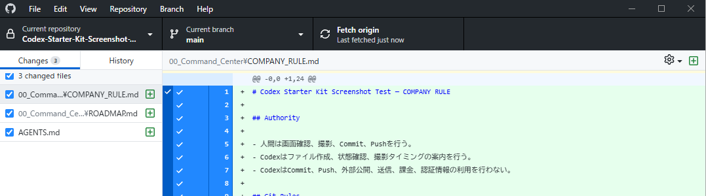
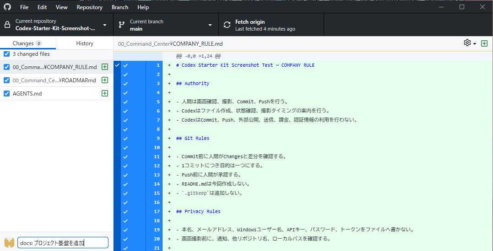
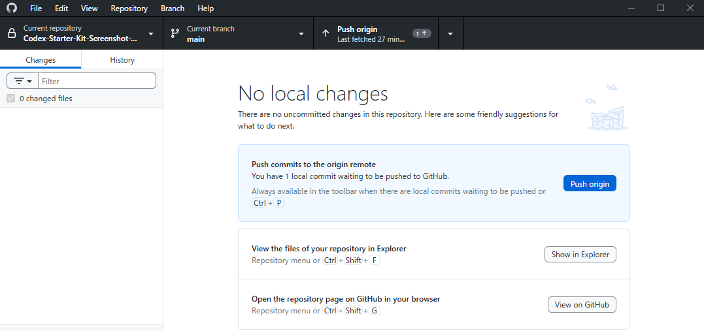
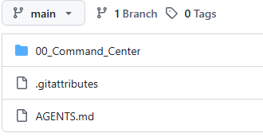

# Chapter 8：基盤3文書を保存する

## この章の目的

基盤3文書だけを確認し、人間が第1CommitとPushを完了できるようにします。

## この章の前提

次の3ファイルが作成済みで、README.mdはまだ作成していない状態です。

- `AGENTS.md`
- `00_Command_Center/ROADMAP.md`
- `00_Command_Center/COMPANY_RULE.md`

## 保存前に確認すること

GitHub DesktopのChangesには、次の3ファイルだけが表示されていることを確認します。

- `AGENTS.md`
- `00_Command_Center/ROADMAP.md`
- `00_Command_Center/COMPANY_RULE.md`

README.mdや、今回の目的と関係ないファイルが表示されている場合は、Commitしません。



> Commit前に、Changesが基盤3文書だけになっていることを確認します。

## ファイルのチェック

Changesを開き、次を一つずつ確認します。

1. 3ファイルにチェックが入っている。
2. 他のファイルが混ざっていない。
3. 個人情報や認証情報が含まれていない。
4. ファイルパスが正しい。
5. 内容を一度読む。

チェック欄の使い方や表示は、GitHub Desktopの更新で変わる場合があります。実際の画面を確認してください。

## Summaryを入力する

Summaryへ、次を入力します。

```text
docs: プロジェクト基盤を追加
```

Summaryは、何を保存するCommitかを後で分かるようにする短い説明です。SummaryとChangesのファイルが一致していることを確認します。



> SummaryとChangesの内容が一致していることを確認します。

## Commitする

Commitは、確認した変更をパソコン側の履歴へ記録する操作です。

1. SummaryとChangesをもう一度確認します。
2. 問題がなければ、人間がCommitボタンを押します。
3. Commitが完了したことを確認します。

CodexはCommitを実行しません。

## Pushする

Pushは、Commitした履歴をGitHubへ送る操作です。CommitとPushは別の操作です。

1. Commit後に **Push origin** が表示されていることを確認します。
2. 内容に問題がなければ、人間がPush originを押します。
3. Push完了後に、ブラウザ版GitHubを開きます。



> Commit後、Changesが空になったことを確認してからPushします。

## ブラウザ版GitHubで確認する

Push後、ブラウザ版GitHubで次を確認します。

- `AGENTS.md`
- `00_Command_Center`
- `ROADMAP.md`
- `COMPANY_RULE.md`
- Commit履歴



> Push後、GitHub上に基盤ファイルが反映されていることを確認します。
> この画像では `00_Command_Center` は閉じているため、`ROADMAP.md` と `COMPANY_RULE.md` は直接表示されていません。

## Changesが空になったことを確認する

Push後、GitHub DesktopのChangesが空であることを確認します。

README.mdを作る前に未Commitの変更が残っていると、README.md以外のファイルもChangesに表示されます。基盤3文書を先に保存しておくと、次の作業ではREADME.mdだけを確認できます。

## 問題がある場合

次の場合はCommitしません。

- 予定より多いファイルが表示される。
- Summaryと変更内容が合わない。
- 個人情報や認証情報がある。
- 正しいリポジトリか分からない。
- ファイル内容を確認していない。

問題がある場合は、Changesと対象リポジトリを確認してからCodexへ相談します。Push後に慌てて履歴を書き換える必要はありません。

## 画像IDについて

この章では、`SCREENSHOT_PLAN.md`に記録されたIDを使います。計画上、S-002はローカルパス確認、S-003は基盤3文書のChanges、S-004はSummary、S-005はPush origin、S-006はブラウザ版GitHubです。

## Chapter 8の完了条件

- [ ] Changesに基盤3文書だけが表示されていることを確認した。
- [ ] Summaryと3ファイルの内容が一致していることを確認した。
- [ ] 人間が第1Commitを実行した。
- [ ] 人間がPushを実行した。
- [ ] ブラウザ版GitHubで基盤3文書とCommit履歴を確認した。
- [ ] GitHub DesktopのChangesが空であることを確認した。

## この章でできるようになったこと

基盤3文書を一つの目的として確認し、人間の操作でCommit・Pushできます。

## 次の章へ進む条件

基盤3文書がGitHubへ反映され、Changesに未Commitの変更が残っていません。

## 体調や時間に余裕がない日の最小タスク

15分以内を目安に、Changesに表示されるファイル名とSummaryが一致しているかだけを確認します。Commit・Pushは、確認できるときに人間が行います。
