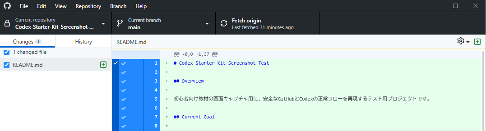
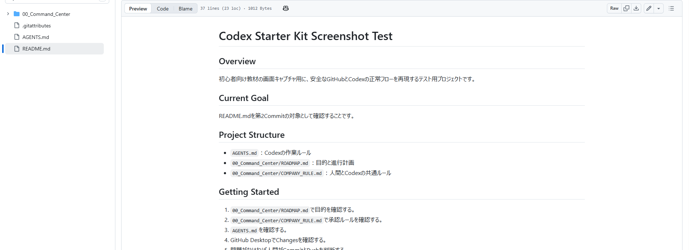
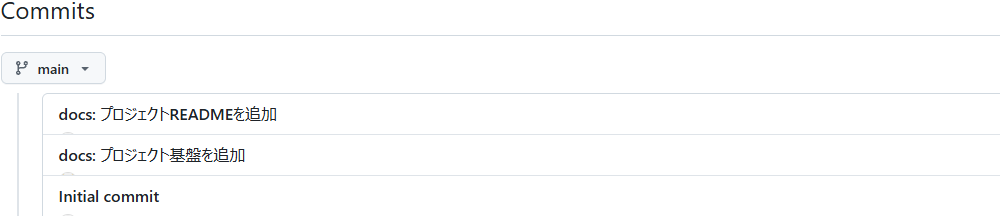

# Chapter 10：README.mdだけを確認して保存する

## この章の目的

README.mdだけを確認し、第2Commit・Pushとして保存します。

## この章で行うこと

- ChangesにREADME.mdだけが表示されていることを確認します。
- READMEの内容を確認します。
- 人間が第2Commit・Pushを行い、ブラウザ版GitHubで確認します。

## 手順

1. GitHub DesktopのChangesを開きます。
2. `README.md`だけが表示されていることを確認します。
3. 基盤3文書がChangesに混ざっていないことを確認します。



> README.mdだけがChangesにあることを確認します。

4. READMEの見出し、目的、構成、再開方法、安全ルールを読みます。
5. Summaryへ次を入力します。

```text
docs: プロジェクトREADMEを追加
```

6. SummaryとREADME.mdだけが一致していることを確認します。
7. 問題がなければ、人間がCommitを実行します。
8. Commit後、人間がPush originを実行します。
9. ブラウザ版GitHubでREADME.mdとCommit履歴を確認します。



> Push後、README.mdがGitHub上に反映されていることを確認します。



> 最後にCommit履歴が3段階になっていることを確認します。上から `docs: プロジェクトREADMEを追加`、`docs: プロジェクト基盤を追加`、`Initial commit` の順に表示されます。

## よくある間違い

- README.md以外のファイルがChangesにあるままCommitする。原因を確認し、Commitを止めます。
- SummaryがREADME用なのに、複数のファイルを含める。SummaryとChangesを読み比べます。
- Push後にブラウザ版GitHubを確認しない。READMEとCommit履歴を確認します。
- Push後に間違いへ気づき、慌てて履歴を書き換える。個人情報・認証情報がない場合でも、まず変更内容を確認してから次の対応を判断します。

## 完了条件

- [ ] ChangesにREADME.mdだけが表示された。
- [ ] READMEの内容を確認した。
- [ ] SummaryとCommit対象が一致している。
- [ ] 人間が第2CommitとPushを実行した。
- [ ] ブラウザ版GitHubでREADME.mdとCommit履歴を確認した。

## 次の章

次は、途中で止まっても同じプロジェクトを再開する方法を確認します。

## 体調や時間に余裕がない日の最小タスク

今日はここまででも大丈夫です。Changesに`README.md`だけが表示されているか確認します。
